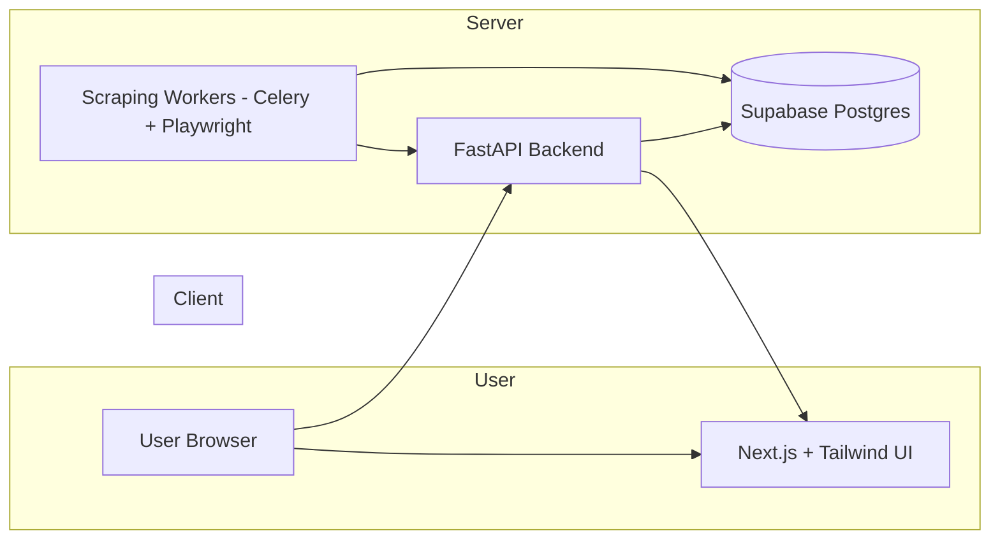

# 📰 Philippine News Aggregator

A modern, full-stack news aggregation platform that collects articles from multiple Philippine news outlets, normalizes the data, and presents them through a clean web dashboard. Built as a student capstone project with production-level architecture and best practices.

## 🎯 Project Overview

This platform automatically scrapes news from major Philippine news sources, normalizes the content, and serves it through a responsive web interface with advanced filtering and search capabilities.

## ⚡ Tech Stack

### Frontend (User-Facing)
- **Next.js 14** – React framework for SSR/SSG
- **TailwindCSS** – Utility-first CSS framework
- **ShadCN/UI** – Modern UI component library
- **React Query / TanStack Query** – Client-side data fetching & caching
- **TypeScript** – Type-safe development

### Backend (APIs & Services)
- **FastAPI** – High-performance REST API framework
- **Celery + Redis** – Distributed task queue for scheduled scraping
- **Playwright** – Web scraping automation (headless browser)
- **BeautifulSoup4** – HTML parsing and extraction
- **Newspaper3k** – Article content extraction helper
- **Python 3.11+** – Backend runtime

### Database & Infrastructure
- **Supabase (PostgreSQL)** – Central database with real-time capabilities
- **Docker** – Containerization for all services
- **Vercel** – Frontend hosting and deployment
- **Railway/Fly.io/Render** – Backend and worker deployment
- **GitHub Actions** – CI/CD pipeline

## 🏗️ System Architecture



## 📂 Project Structure

```
ph-eye/
├── frontend/                 # Next.js application
│   ├── components/          # Reusable UI components
│   ├── pages/              # Next.js pages
│   ├── lib/                # Utilities and API clients
│   └── styles/             # Global styles and Tailwind config
├── backend/                 # FastAPI application
│   ├── app/                # FastAPI application code
│   ├── scrapers/           # Individual scraper modules
│   ├── workers/            # Celery task definitions
│   └── tests/              # Backend tests
├── docker/                  # Docker configuration files
├── docs/                    # Project documentation
└── scripts/                 # Development and deployment scripts
```

## 🚀 Development Roadmap

### Phase 1: Foundation & Setup (Week 1-2)
- [ ] Initialize Supabase project and database
- [ ] Setup Next.js project with Tailwind + ShadCN UI
- [ ] Initialize FastAPI project with Docker configuration
- [ ] Create database schema in Supabase
- [ ] Setup development environment and tooling

### Phase 2: Scraper Engine (Week 3-4)
- [ ] Implement Playwright scraper for major news sources:
  - [ ] ABS-CBN News
  - [ ] GMA News Online
  - [ ] Philippine Daily Inquirer
  - [ ] Philippine Star
  - [ ] Manila Bulletin
- [ ] Create data normalization pipeline
- [ ] Setup Celery + Redis for task scheduling
- [ ] Implement error handling and retry strategies

### Phase 3: API Layer (Week 5-6)
- [ ] Build FastAPI endpoints:
  - [ ] `GET /articles` – List articles with filtering
  - [ ] `GET /articles/{id}` – Get single article
  - [ ] `GET /sources` – List news sources
  - [ ] `GET /categories` – List article categories
- [ ] Implement pagination and caching
- [ ] Add rate limiting and API security
- [ ] Write comprehensive API tests

### Phase 4: Frontend Development (Week 7-8)
- [ ] Build responsive homepage with latest headlines
- [ ] Implement category and source filtering
- [ ] Create article detail pages
- [ ] Add search functionality
- [ ] Implement dark mode and responsive design

### Phase 5: Production & Enhancement (Week 9-10)
- [ ] Setup CI/CD pipeline with GitHub Actions
- [ ] Deploy to production environments
- [ ] Add admin dashboard for monitoring
- [ ] Implement analytics and monitoring
- [ ] Performance optimization and testing

## 🗄️ Database Schema

```sql
-- News Sources
CREATE TABLE sources (
    id SERIAL PRIMARY KEY,
    name TEXT NOT NULL UNIQUE,
    url TEXT NOT NULL,
    logo_url TEXT,
    is_active BOOLEAN DEFAULT true,
    last_scraped TIMESTAMP,
    created_at TIMESTAMP DEFAULT NOW(),
    updated_at TIMESTAMP DEFAULT NOW()
);

-- Categories
CREATE TABLE categories (
    id SERIAL PRIMARY KEY,
    name TEXT NOT NULL UNIQUE,
    slug TEXT NOT NULL UNIQUE,
    description TEXT,
    color TEXT,
    created_at TIMESTAMP DEFAULT NOW()
);

-- Articles
CREATE TABLE articles (
    id SERIAL PRIMARY KEY,
    source_id INT REFERENCES sources(id) ON DELETE CASCADE,
    category_id INT REFERENCES categories(id) ON DELETE SET NULL,
    title TEXT NOT NULL,
    slug TEXT NOT NULL,
    url TEXT UNIQUE NOT NULL,
    content TEXT,
    excerpt TEXT,
    featured_image TEXT,
    published_at TIMESTAMP,
    scraped_at TIMESTAMP DEFAULT NOW(),
    created_at TIMESTAMP DEFAULT NOW(),
    updated_at TIMESTAMP DEFAULT NOW()
);

-- Tags for articles (many-to-many)
CREATE TABLE tags (
    id SERIAL PRIMARY KEY,
    name TEXT NOT NULL UNIQUE,
    slug TEXT NOT NULL UNIQUE,
    created_at TIMESTAMP DEFAULT NOW()
);

CREATE TABLE article_tags (
    article_id INT REFERENCES articles(id) ON DELETE CASCADE,
    tag_id INT REFERENCES tags(id) ON DELETE CASCADE,
    PRIMARY KEY (article_id, tag_id)
);

-- Scraping logs for monitoring
CREATE TABLE scraping_logs (
    id SERIAL PRIMARY KEY,
    source_id INT REFERENCES sources(id) ON DELETE CASCADE,
    status TEXT NOT NULL, -- 'success', 'error', 'partial'
    articles_scraped INT DEFAULT 0,
    error_message TEXT,
    started_at TIMESTAMP DEFAULT NOW(),
    completed_at TIMESTAMP,
    execution_time_ms INT
);

-- Indexes for performance
CREATE INDEX idx_articles_published_at ON articles(published_at);
CREATE INDEX idx_articles_category_id ON articles(category_id);
CREATE INDEX idx_articles_source_id ON articles(source_id);
CREATE INDEX idx_articles_title ON articles USING gin(to_tsvector('english', title));
CREATE INDEX idx_articles_content ON articles USING gin(to_tsvector('english', content));
```

## 🛠️ Development Guidelines

### Code Quality Standards
- **Python**: Follow PEP 8, use type hints, write docstrings
- **JavaScript/TypeScript**: Use ESLint + Prettier, follow Next.js conventions
- **Testing**: Minimum 80% code coverage, write tests for all API endpoints
- **Documentation**: Keep README updated, document API endpoints

### Scraper Development
- **Modularity**: One Python file per news source
- **Error Handling**: Comprehensive logging and retry strategies
- **Resilience**: Handle site changes gracefully with fallback strategies
- **Rate Limiting**: Respect robots.txt and implement polite delays

### API Development
- **RESTful Design**: Follow REST conventions and HTTP status codes
- **Validation**: Use Pydantic models for request/response validation
- **Caching**: Implement Redis caching for frequently accessed data
- **Security**: Rate limiting, CORS configuration, input sanitization

### Frontend Development
- **Performance**: Implement lazy loading, image optimization
- **Accessibility**: WCAG 2.1 AA compliance
- **Responsive Design**: Mobile-first approach with Tailwind breakpoints
- **State Management**: Use React Query for server state, local state for UI

## 🔧 Environment Setup

### Prerequisites
- Node.js 18+ and npm/yarn
- Python 3.11+
- Docker and Docker Compose
- Redis (local or cloud)
- Supabase account

### Local Development
```bash
# Clone repository
git clone <repository-url>
cd ph-eye

# Backend setup
cd backend
python -m venv venv
source venv/bin/activate  # On Windows: venv\Scripts\activate
pip install -r requirements.txt

# Frontend setup
cd ../frontend
npm install

# Environment configuration
cp .env.example .env.local
# Configure your environment variables

# Start development servers
# Terminal 1: Backend
cd backend && uvicorn app.main:app --reload

# Terminal 2: Frontend
cd frontend && npm run dev

# Terminal 3: Celery worker
cd backend && celery -A app.worker worker --loglevel=info

# Terminal 4: Redis (if not using Docker)
redis-server
```

### Docker Development
```bash
# Start all services
docker-compose up -d

# View logs
docker-compose logs -f

# Stop services
docker-compose down
```

## 📊 Monitoring & Maintenance

### Health Checks
- API endpoint health monitoring
- Scraper success/failure rates
- Database performance metrics
- Frontend Core Web Vitals

### Logging Strategy
- Structured logging with correlation IDs
- Error tracking and alerting
- Performance monitoring
- User analytics (privacy-compliant)

### Backup & Recovery
- Automated database backups
- Disaster recovery procedures
- Data retention policies
- Rollback procedures

## 🚀 Deployment

### Frontend (Vercel)
- Automatic deployments from main branch
- Preview deployments for PRs
- Environment-specific configurations
- Performance monitoring

### Backend (Railway/Fly.io/Render)
- Containerized deployment
- Auto-scaling based on load
- Health check monitoring
- Log aggregation

### Database (Supabase)
- Managed PostgreSQL hosting
- Automated backups
- Real-time subscriptions
- Row-level security

## 🧪 Testing Strategy

### Backend Testing
- **Unit Tests**: Pytest for individual functions
- **Integration Tests**: Test database interactions
- **API Tests**: HTTPX for endpoint testing
- **Scraper Tests**: Mock responses for consistent testing

### Frontend Testing
- **Unit Tests**: Jest + React Testing Library
- **E2E Tests**: Playwright for critical user flows
- **Visual Regression**: Screenshot testing
- **Performance Tests**: Lighthouse CI

## 📈 Performance Considerations

### Backend Optimization
- Database query optimization
- Redis caching strategies
- Async processing for heavy operations
- Connection pooling

### Frontend Optimization
- Code splitting and lazy loading
- Image optimization and CDN
- Bundle size monitoring
- Core Web Vitals optimization

## 🔒 Security Considerations

- API rate limiting and authentication
- Input validation and sanitization
- CORS configuration
- Environment variable security
- Regular dependency updates
- Security headers implementation

## 📚 Additional Resources

- [FastAPI Documentation](https://fastapi.tiangolo.com/)
- [Next.js Documentation](https://nextjs.org/docs)
- [TailwindCSS Documentation](https://tailwindcss.com/docs)
- [Supabase Documentation](https://supabase.com/docs)
- [Playwright Documentation](https://playwright.dev/)

## 🤝 Contributing

1. Fork the repository
2. Create a feature branch (`git checkout -b feature/amazing-feature`)
3. Commit your changes (`git commit -m 'Add amazing feature'`)
4. Push to the branch (`git push origin feature/amazing-feature`)
5. Open a Pull Request

## 📄 License

This project is licensed under the MIT License - see the [LICENSE](LICENSE) file for details.

## 🎓 Academic Context

This project serves as a capstone project demonstrating:
- Full-stack development skills
- System architecture design
- Data engineering and automation
- Production-ready development practices
- Scalable application design

---

**Note**: This is a student project designed with production-level practices. While functional and well-architected, it should not be used in production environments without additional security reviews and compliance considerations.
# ph-eye
# the-eye
# the-eye
# the-eye
