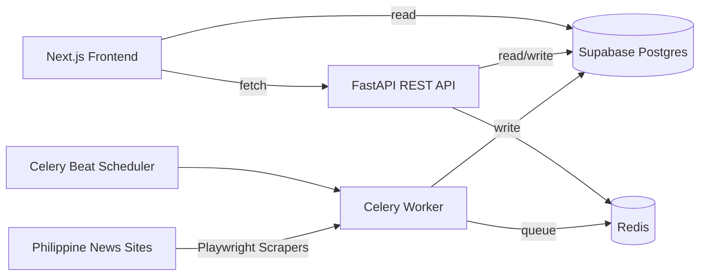

# PH Eye

PH Eye is a full-stack capstone project that continuously collects Philippine online news, runs lightweight NLP (sentiment + NER), and renders dashboards for trends, correlation, entities, and per-source browsing.

## Features

- Automated scraping via Playwright-based scrapers (Celery workers).
- FastAPI backend with REST endpoints for articles and analytics.
- Sentiment analysis using NLTK VADER (stored in `bias_analysis` as `model_type='sentiment'`).
- Named Entity Recognition (spaCy) for PERSON/ORG/GPE extraction and aggregation.
- Frontend dashboards:
  - Home: latest articles grouped by source.
  - Trends: daily sentiment distribution and averages.
  - Correlation: Pearson correlation heatmap across sources using daily average sentiment.
  - Entities: top entities by mentions, optionally with average sentiment.
  - Source page: paginated listing with keyword search.

## Tech Stack

- Frontend: Next.js (App Router) + React + TypeScript + Tailwind CSS + Recharts + TanStack Query + Supabase JS.
- Backend: FastAPI + Celery + Redis + Playwright + BeautifulSoup4/lxml + Supabase (PostgreSQL).
- NLP: NLTK VADER, spaCy.
- Infra: Docker Compose (Redis + API + worker + beat).

## Architecture


```mermaid
flowchart LR
  Sources[Philippine News Sites] -->|Playwright Scrapers| Worker[Celery Worker]
  Beat[Celery Beat Scheduler] --> Worker
  Worker -->|write| DB[(Supabase Postgres)]

  API[FastAPI REST API] -->|read/write| DB
  Worker -->|queue| Redis[(Redis)]
  API --> Redis

  UI[Next.js Frontend] -->|fetch| API
  UI -->|read| DB
```

Notes:
- The frontend reads most aggregates from the backend (`NEXT_PUBLIC_BACKEND_URL`), and also reads article rows directly from Supabase in some views.
- Correlation is computed from daily average sentiment scores (Pearson `r`) across overlapping days per source pair.

## Repo Structure (Relevant)

- `src/`: Next.js frontend (pages in `src/app/*`).
- `src/types/database.ts`: Supabase-generated DB types (see below).
- `backend/app/`: FastAPI application (`backend/app/main.py` is the entrypoint).
- `backend/app/workers/`: Celery worker + tasks.
- `backend/app/scrapers/`: Source scrapers.
- `backend/app/scrapers/support/`: Shared scraper helpers (stealth profile + Playwright/http wrappers).
- `backend/scripts/`: maintenance and analysis scripts.
- `docker-compose.yml`: Redis + api + worker + beat.
- `docker-compose.prod.yml`: Same services, but API runs without `--reload` (more stable for smoke tests).

## Quickstart (Local Dev)

Prereqs:
- Node.js 20+
- Python 3.11+
- Docker Desktop
- A Supabase project (URL + keys)

1. Configure environment variables

Backend (`backend/.env`):
- `SUPABASE_URL`
- `SUPABASE_SERVICE_ROLE_KEY`
- Optional: `ADMIN_TOKEN` (guards some maintenance endpoints)

Frontend (`.env.local`):
- `NEXT_PUBLIC_SUPABASE_URL`
- `NEXT_PUBLIC_SUPABASE_ANON_KEY`
- `NEXT_PUBLIC_BACKEND_URL` (default used in code: `http://localhost:8000`)
- Optional: `NEXT_PUBLIC_ANALYTICS_SOURCE`

2. Start backend services (Redis + API + worker + beat)

```bash
docker compose up -d

# Linux-only (optional overrides):
docker compose -f docker-compose.yml -f docker-compose.linux.yml up -d
```

```powershell
docker compose up -d
```

API will be on `http://localhost:8000`.

For a more stable run (no FastAPI hot-reload), use:

```bash
docker compose -f docker-compose.prod.yml up -d

# Linux-only (optional overrides):
docker compose -f docker-compose.prod.yml -f docker-compose.linux.yml up -d
```

```powershell
docker compose -f docker-compose.prod.yml up -d
```

3. Start the frontend

```bash
npm install
npm run dev
```

Frontend will be on `http://localhost:3000`.

## Smoke Test (Backend)

Run a minimal API sanity check suite (requires backend running):

```bash
python3 backend/scripts/smoke_test.py
# or:
bash backend/scripts/smoke_test.sh
```

```powershell
powershell -NoProfile -ExecutionPolicy Bypass -File backend/scripts/smoke_test.ps1
```

## Pipeline Test (Scrape + Verify)

Runs one scrape task, polls status, then hits key API endpoints:

```bash
python3 backend/scripts/pipeline_test.py --source inquirer
# or:
bash backend/scripts/pipeline_test.sh --source inquirer
```

```powershell
powershell -NoProfile -ExecutionPolicy Bypass -File backend/scripts/pipeline_test.ps1 -Source inquirer
```

## Manual Scrape (Queue a Scraper Job)

Supported `source` values:
- `inquirer`
- `gma`
- `philstar`
- `manila_bulletin`
- `rappler`
- `sunstar`
- `manila_times`

Queue a job:

```bash
curl -s -X POST "http://localhost:8000/scrape/run" \
  -H "Content-Type: application/json" \
  -d '{"source":"inquirer"}'

# Queue multiple scrapers at once
curl -s -X POST "http://localhost:8000/scrape/run" \
  -H "Content-Type: application/json" \
  -d '{"sources":["inquirer","gma","philstar","manila_bulletin","rappler","sunstar","manila_times"]}'
```

```powershell
$run = Invoke-RestMethod "http://localhost:8000/scrape/run" `
  -Method Post `
  -ContentType "application/json" `
  -Body '{"source":"inquirer"}'

# Queue multiple scrapers at once
$run = Invoke-RestMethod "http://localhost:8000/scrape/run" `
  -Method Post `
  -ContentType "application/json" `
  -Body '{"sources":["inquirer","gma","philstar","manila_bulletin","rappler","sunstar","manila_times"]}'
```

Check status (from the response `jobs[0].task_id`):

```bash
curl -s "http://localhost:8000/scrape/status/<task_id>"
```

```powershell
$taskId = $run.jobs[0].task_id
Invoke-RestMethod "http://localhost:8000/scrape/status/$taskId"
```

## ML Backfill (Fix Missing Sentiment Labels)

Sometimes articles exist in Supabase but are missing sentiment rows (so the UI shows unlabeled items). This backfill scans for missing sentiment and queues ML analysis jobs to fill `bias_analysis` + `article_sentiment_public`.

Linux / bash:

```bash
# Real run (queues ML tasks)
./backfill.sh 30 200

# Dry run (no tasks queued; only prints missing IDs)
./backfill.sh 30 200 --dry-run

# Watch progress
sudo docker logs -f ph-eye-worker-ml
```

Windows / PowerShell:

```powershell
# Real run (queues ML tasks)
.\backfill.ps1 -Days 30 -BatchSize 200

# Dry run (no tasks queued; only prints missing IDs)
.\backfill.ps1 -Days 30 -BatchSize 200 -DryRun

# Watch progress
docker logs -f ph-eye-worker-ml
```

## Fix Low “Coverage (7d)” %

The homepage **Coverage (7d)** metric is:

> `(# articles in last 7 days with a row in article_sentiment_public) / (total # articles in last 7 days)`

If `article_sentiment_public` was added later (or was temporarily failing), you can have sentiment rows in
`bias_analysis` but still be missing the **public cache** rows — which makes coverage look artificially low.

Backfill the public cache from existing sentiment rows:

Linux / bash:

```bash
# Preview what would be upserted
./backfill_public_sentiment.sh 7 --dry-run

# Apply (writes to article_sentiment_public)
./backfill_public_sentiment.sh 7 --apply 500
```

Windows / PowerShell:

```powershell
# Preview
.\backfill_public_sentiment.ps1 -Days 7

# Apply
.\backfill_public_sentiment.ps1 -Days 7 -Apply -BatchSize 500
```

## Fix Wrong `published_at` (Time Drift / Dual-Boot Clock Issues)

If your PC clock was wrong while scraping (common in Windows+Linux dual boot), some articles can get a `published_at` timestamp that is **in the future** relative to `inserted_at`. This breaks Trends daily bucketing.

This helper scans recent rows and fixes the two most common issues:
- **Timezone skew (~+8h):** `published_at` was saved without a timezone and got interpreted as UTC (shifts day buckets). Fix: shift `published_at` back by 8 hours.
- **True future drift:** `published_at` is far ahead of `inserted_at`. Fix: set `published_at = inserted_at`.

Linux / bash:

```bash
# Dry run (recommended first)
./fix_published_at.sh 7 --dry-run

# Apply fixes
./fix_published_at.sh 7 --apply
```

Windows / PowerShell:

```powershell
# Dry run (recommended first)
.\fix_published_at.ps1 -Days 7 -DryRun

# Apply fixes
.\fix_published_at.ps1 -Days 7 -Apply
```

## Why Scrapers Sometimes “Wait” After `docker compose up -d`

By default, scrapers are scheduled by Celery Beat on intervals, so the **first automatic run** can be delayed until the interval is due:
- `rappler`: every 3600s (1h 00m)
- `gma`: every 3888s (1h 04m 48s)
- `philstar`: every 4212s (1h 10m 12s)
- `inquirer`: every 4500s (1h 15m 00s)
- `manila_bulletin`: every 4788s (1h 19m 48s)
- `manila_times`: every 5112s (1h 25m 12s)
- `sunstar`: every 5400s (1h 30m 00s)

If you want scrapes to run immediately, use the manual `POST /scrape/run` commands above or run `backend/scripts/pipeline_test.py`.

## Legacy Root Tools (Archived)

Older one-off scripts (tests, beat monitors, etc.) were moved out of the repo root into `archive/legacy/root_tools/` to keep the root clean. The supported verification flow is `backend/scripts/smoke_test.ps1` and `backend/scripts/pipeline_test.ps1`.

## Common Endpoints

- Health: `GET /`, `GET /health`
- Scraping: `POST /scrape/run`, `GET /scrape/status/{task_id}`
- Articles: `GET /articles`, `GET /articles/home-optimized`, `GET /articles/{article_id}`, `GET /articles/{article_id}/analysis`
- Analytics:
  - `GET /ml/trends?period=7d|30d&source=...`
  - `GET /ml/correlation?period=7d|30d`
  - `GET /ml/entities/top?period=7d|30d`
  - `GET /ml/ner/sample`

## Demo Mode (No Deployed FastAPI)

For thesis demos, you can deploy only the Next.js frontend to Vercel and read precomputed analytics from Supabase:

1. Run these SQL files in the Supabase SQL editor:
   - `backend/scripts/create_entity_rankings_tables.sql`
   - `backend/scripts/create_demo_analytics_tables.sql`
2. Keep your home PC (Docker worker) running to scrape/analyze, then write snapshots:

```bash
docker compose exec worker python scripts/entity_rankings_snapshot.py 7d
docker compose exec worker python scripts/trends_snapshot.py 7d
docker compose exec worker python scripts/correlation_snapshot.py 7d
```

The frontend will automatically fall back to Supabase snapshots when `NEXT_PUBLIC_BACKEND_URL` is not usable.

## Supabase Type Safety

Generate/update types:

```bash
supabase gen types typescript --project-id <PROJECT_ID> --schema public > src/types/database.ts
```

```powershell
supabase gen types typescript --project-id <PROJECT_ID> --schema public | Out-File -Encoding utf8 src/types/database.ts
```

## Troubleshooting

- DNS / Supabase resolution issues in Docker:
  - See `[FIX_DNS_ISSUE.md](FIX_DNS_ISSUE.md)`.
- Next.js builds appear “stuck” on Windows:
  - This repo defaults `npm run build` to `next build` (Webpack). Turbopack builds can be extremely slow on some Windows filesystems and can leave long-running Node processes.
  - If you previously ran Turbopack builds, kill the old Node build process and re-run: `npm.cmd run build`.
  - Excluding the repo folder (and `.next/`) from Windows Defender/antivirus can drastically improve build speed.
- Analytics looks "unscored" even though `bias_analysis` has sentiment rows:
  - Supabase/PostgREST commonly caps result sets around ~1000 rows unless you explicitly paginate.
  - Some analytics endpoints batch `bias_analysis` reads using an `IN (article_ids...)` filter; if that batch is too large, older days can look like `Analyzed 0/N` because the response is silently truncated to newer rows.
  - Fix: keep batches small (this repo uses ~250 IDs per request in `backend/app/api/ml_router.py` for `/ml/trends`, `/ml/correlation`, and `/ml/entities/top`).
- Slow local scanning / indexing on Windows:
  - Exclude `node_modules/` and `.next/` in your editor, and avoid recursive searches over them.
- Missing days / partial coverage:
  - Scrapers depend on uptime and site stability. Power interruptions, rate limits, and HTML changes can create gaps.
