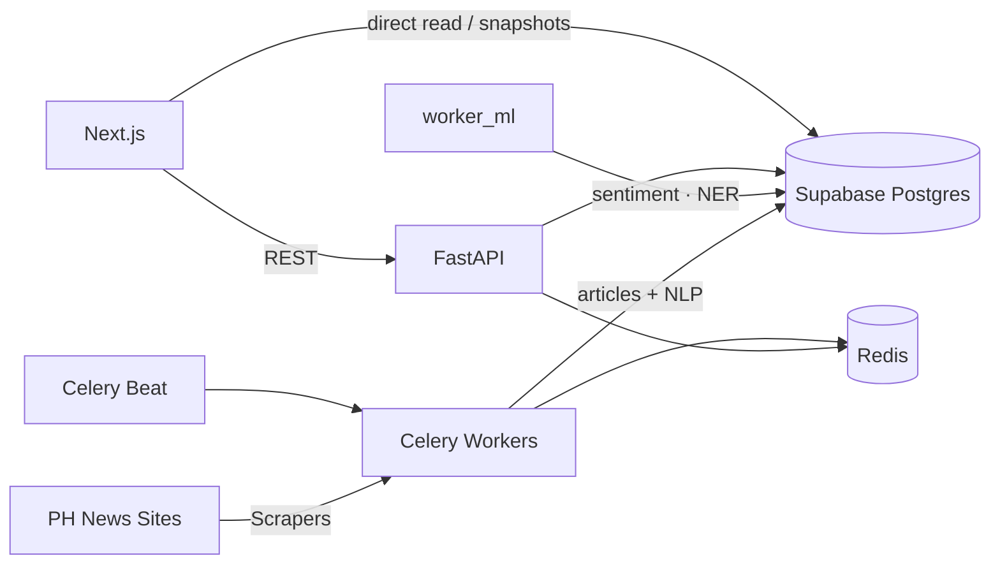

# PH VibeCheck AI

**Sentiment & entity analytics over Philippine online news** — scrape → NLP pipeline → dashboards.

A full-stack capstone / portfolio project that ingests articles from major PH news sources, classifies sentiment with a **hybrid VADER + DistilBERT** router, extracts entities with **spaCy**, and visualizes trends, cross-source correlation, and entity rankings.

> **Live demo status:** The public site runs in **portfolio demo mode** — charts and article lists are served from a **frozen Supabase snapshot** (scrapers are not kept online). Expect a clear “Portfolio demo data” banner on analytics pages.

<!-- Add your live URL after deploy:
**Demo:** https://your-app.vercel.app  
-->

---

## Why this exists

Philippine news is high-volume and often **Taglish**. This project explores a practical pipeline that:

1. Continuously collects multi-source headlines and article bodies  
2. Scores polarity in a way that routes Tagalog-heavy text differently from English-leaning text  
3. Surfaces **trends**, **source correlation**, and **top entities** for analysts / researchers  

Built as a university capstone; maintained as a portfolio showcase of production-shaped engineering (queues, Docker, evals, demo freezes).

---

## Features

| Area | What you get |
|------|----------------|
| **Ingestion** | Playwright / HTTP / RSS / API fast-paths for 8 PH sources (Inquirer, GMA, Rappler, ABS-CBN, Philstar, Manila Bulletin, Manila Times, SunStar) |
| **Sentiment** | Hybrid router: Tagalog signal → VADER + PH lexicon patch; else DistilBERT SST-2 + confidence neutral band |
| **NER** | spaCy PERSON / ORG / GPE (+ related) with ranking + average sentiment |
| **Dashboards** | Home feed · Trends · Correlation heatmap · Entity rankings · Source search |
| **Portfolio mode** | Precomputed Supabase snapshots so recruiters see real charts without running workers |

---

## Tech stack

| Layer | Stack |
|-------|--------|
| Frontend | Next.js 15 (App Router), React 19, TypeScript, Tailwind, Recharts, TanStack Query, Supabase JS |
| Backend | FastAPI, Celery, Redis, Playwright, BeautifulSoup/lxml |
| Data | Supabase (PostgreSQL) |
| NLP | NLTK VADER, DistilBERT (Transformers), spaCy |
| Ops | Docker Compose, optional GitHub Actions snapshot jobs |

---

## Architecture


```mermaid
flowchart LR
  Sources[PH News Sites] -->|Scrapers| Worker[Celery Workers]
  Beat[Celery Beat] --> Worker
  Worker -->|articles + NLP| DB[(Supabase Postgres)]
  WorkerML[worker_ml] -->|sentiment · NER| DB
  API[FastAPI] --> DB
  API --> Redis[(Redis)]
  Worker --> Redis
  UI[Next.js] -->|REST| API
  UI -->|direct read / snapshots| DB
```

**Portfolio path:** Trends / Correlation / Entities (+ Home feed) can read **frozen snapshot tables** when `NEXT_PUBLIC_ANALYTICS_SOURCE=supabase_snapshots`, so no API/workers are required for demos.

---

## Screenshots

> Tip for applications: add 2–3 PNGs under `docs/screenshots/` (Home, Trends, Correlation) and link them here.

| Home | Trends | Correlation |
|------|--------|-------------|
| _add screenshot_ | _add screenshot_ | _add screenshot_ |

---

## Evaluation (sentiment)

Manual benchmark on labeled news samples (**n = 200**) comparing VADER, DistilBERT, and Hybrid — accuracy, macro-F1, confusion matrices, and per-class precision / recall / F1.

- How to re-run evals: [`docs/FINAL_ACCURACY_EVALUATION.md`](docs/FINAL_ACCURACY_EVALUATION.md)  
- Charts from existing JSON: `backend/scripts/plot_benchmark_metrics.py` → `backend/reports/charts/`

---

## Repository layout

```text
src/                     Next.js App Router UI
backend/app/             FastAPI + scrapers + workers + ML
backend/scripts/         Eval, freeze, SQL helpers, smoke tests
backend/reports/         Benchmark CSVs / JSON / charts
docs/                    Deeper docs + ops runbook
docker-compose*.yml      Local / prod / networking overlays
```

---

## Quick start (developers)

**Prereqs:** Node 20+, Docker, a Supabase project.

```bash
# Backend stack
cp backend/.env.example backend/.env   # if present; else create from README ops doc
docker compose up -d redis api worker beat

# Frontend
cp .env.local.example .env.local       # or create with keys below
npm install
npm run dev
```

| Service | URL |
|---------|-----|
| Frontend | http://localhost:3000 |
| API | http://localhost:8000 |

**Minimal env**

```bash
# backend/.env
SUPABASE_URL=...
SUPABASE_SERVICE_ROLE_KEY=...

# .env.local
NEXT_PUBLIC_SUPABASE_URL=...
NEXT_PUBLIC_SUPABASE_ANON_KEY=...
NEXT_PUBLIC_BACKEND_URL=http://localhost:8000
# Portfolio / demo (no live workers):
# NEXT_PUBLIC_ANALYTICS_SOURCE=supabase_snapshots
```

Full Docker, scrape backfill, DNS/hotspot, and freeze steps: **[`docs/DEVELOPER_OPS.md`](docs/DEVELOPER_OPS.md)**.

---

## Portfolio demo mode

When you are not running scrapers (job-search deploy):

1. Freeze snapshots once (anchored to latest articles in DB) — see ops doc  
2. Set on Vercel: `NEXT_PUBLIC_ANALYTICS_SOURCE=supabase_snapshots`  
3. Keep Supabase URL + anon key; no FastAPI required for analytics pages  

---

## Documentation map

| Doc | Audience |
|-----|----------|
| **This README** | Recruiters / hiring managers / first visit |
| [`docs/DEVELOPER_OPS.md`](docs/DEVELOPER_OPS.md) | Run, scrape, freeze, troubleshoot |
| [`docs/README.md`](docs/README.md) | Index of technical notes |
| [`docs/FINAL_ACCURACY_EVALUATION.md`](docs/FINAL_ACCURACY_EVALUATION.md) | Sentiment eval commands |
| [`docs/ML_AI_INTEGRATION.md`](docs/ML_AI_INTEGRATION.md) | NLP integration notes |
| [`SERVICE_MANAGEMENT.md`](SERVICE_MANAGEMENT.md) | Service start/stop helpers |

---

## What I want interviewers to notice

- End-to-end ownership: scrapers → queues → NLP → Postgres → dashboards  
- Hybrid NLP design for **Taglish**, not a single off-the-shelf English model  
- Measurable evaluation (benchmark + precision/recall visuals), not “vibes only”  
- Production-minded ops: Docker Compose, Celery, demo freeze so the portfolio stays demoable  

---

## License / academic note

Capstone / academic project. Source sites remain property of their publishers; this repo is for learning and portfolio demonstration. Respect robots/terms if you re-enable scraping.
