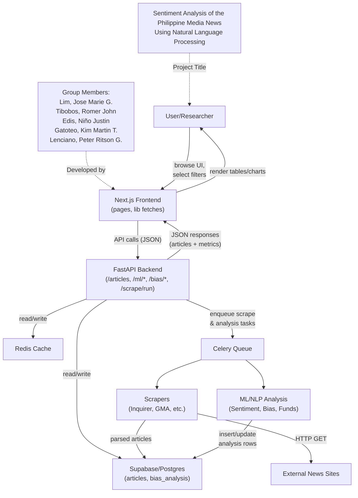
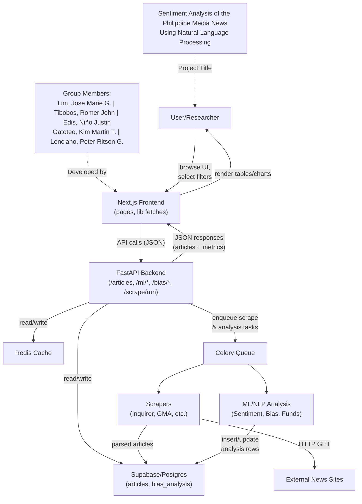
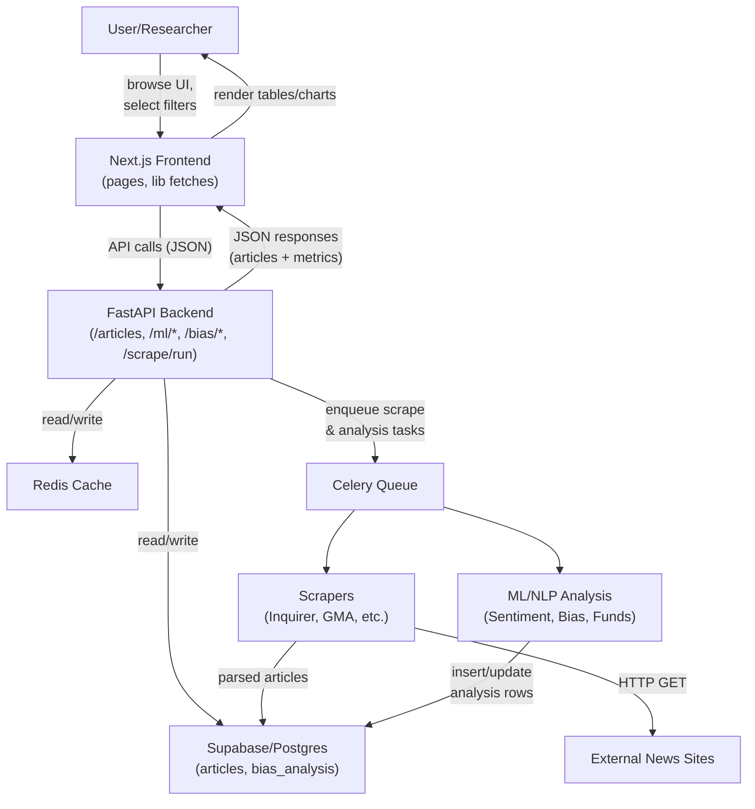

# Data Flow Diagram - Sentiment Analysis of the Philippine Media News Using Natural Language Processing

## Group Members
- Lim, Jose Marie G.
- Tibobos, Romer John
- Edis, Niño Justin
- Gatoteo, Kim Martin T.
- Lenciano, Peter Ritson G.

## System Data Flow Diagram

## Recommended Version (Title and Members as Header Nodes)

## Alternative Version (Simpler Layout)

If the above version has rendering issues, use this simpler version:

**Note:** For your thesis document, you can add the title and group members as text above or below the diagram, or include them in the figure caption.
