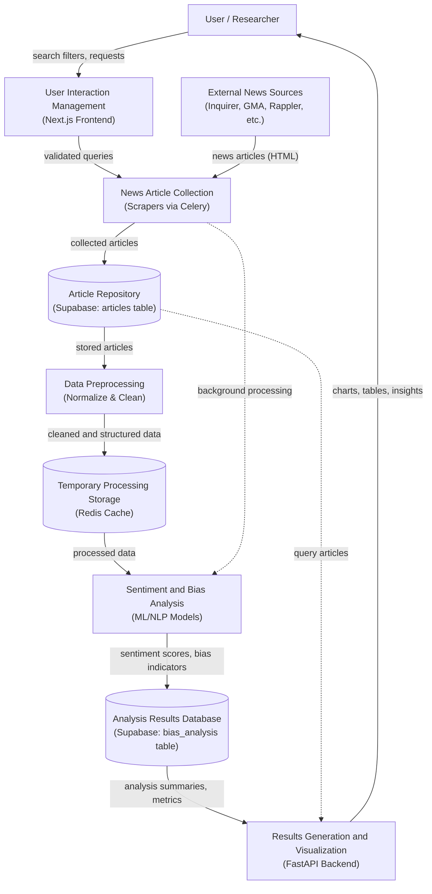
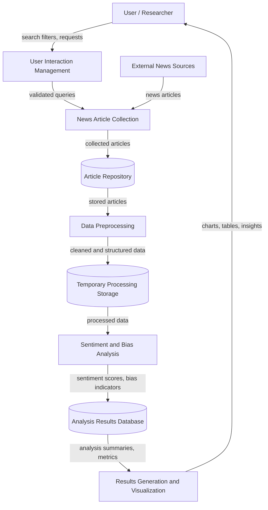
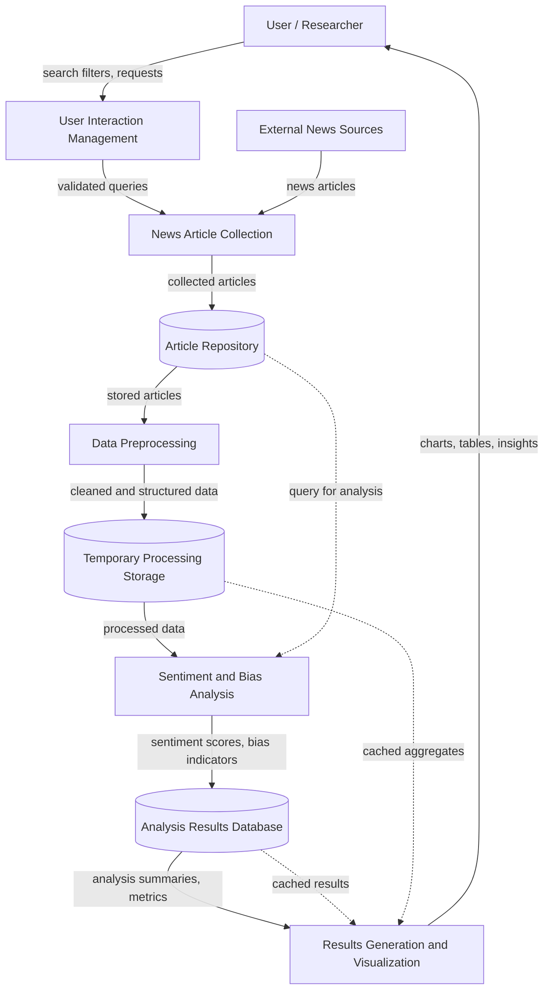

# Data Flow Diagram - Sentiment Analysis of the Philippine Media News Using Natural Language Processing

## Group Members
- Lim, Jose Marie G.
- Tibobos, Romer John
- Edis, Niño Justin
- Gatoteo, Kim Martin T.
- Lenciano, Peter Ritson G.

## Level 0 - Context Diagram (Your Version - Enhanced)

## Level 0 - Pure DFD Version (Your Original - Clean)

## Why Your Version is Better for Thesis:

1. **Proper DFD Notation**: Uses E (External), P (Process), D (Data Store) conventions
2. **Abstract & Conceptual**: Focuses on logical flow, not implementation details
3. **Cleaner**: Easier to understand at a high level
4. **Academic Standard**: More appropriate for CS thesis documentation

## Recommendations:

1. **Add title and group members** as text above/below the diagram in your thesis document (not in the diagram itself - keeps it cleaner)
2. **Consider adding a feedback loop**: Show that analysis results can trigger re-analysis or updates
3. **Add cache flow**: Show that D3 (cache) is also queried by P5 for faster responses

## Enhanced Version with Feedback Loops:

