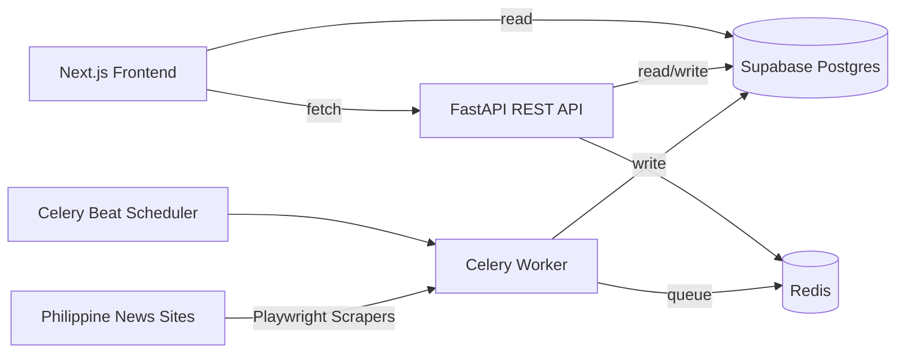

# Developer operations runbook

> This file preserves the full operational README (Docker, scrapers, backfill, DNS,
> portfolio freeze, troubleshooting). The root [`README.md`](../README.md) is the
> recruiter-facing overview; use **this** document when running or maintaining the stack.

---


## Features

- Automated scraping via Playwright-based scrapers (Celery workers).
- FastAPI backend with REST endpoints for articles and analytics.
- Sentiment analysis using NLTK VADER (stored in `bias_analysis` as `model_type='sentiment'`).
- Named Entity Recognition (spaCy) for PERSON/ORG/GPE extraction and aggregation.
- Frontend dashboards:
  - Home: latest articles grouped by source.
  - Trends: daily sentiment distribution and averages.
  - Correlation: Pearson correlation heatmap across sources using daily average sentiment.
  - Entities: top entities by mentions, optionally with average sentiment.
  - Source page: paginated listing with keyword search.

## Tech Stack

- Frontend: Next.js (App Router) + React + TypeScript + Tailwind CSS + Recharts + TanStack Query + Supabase JS.
- Backend: FastAPI + Celery + Redis + Playwright + BeautifulSoup4/lxml + Supabase (PostgreSQL).
- NLP: NLTK VADER, spaCy.
- Infra: Docker Compose (Redis + API + worker + beat).

## Architecture



Notes:
- The frontend reads most aggregates from the backend (`NEXT_PUBLIC_BACKEND_URL`), and also reads article rows directly from Supabase in some views.
- Correlation is computed from daily average sentiment scores (Pearson `r`) across overlapping days per source pair.

## Repo Structure (Relevant)

- `src/`: Next.js frontend (pages in `src/app/*`).
- `src/types/database.ts`: Supabase-generated DB types (see below).
- `backend/app/`: FastAPI application (`backend/app/main.py` is the entrypoint).
- `backend/app/workers/`: Celery worker + tasks.
- `backend/app/scrapers/`: Source scrapers.
- `backend/app/scrapers/support/`: Shared scraper helpers (stealth profile + Playwright/http wrappers).
- `backend/scripts/`: maintenance and analysis scripts.
- `docker-compose.yml`: Redis + api + worker + beat.
- `docker-compose.prod.yml`: Same services, but API runs without `--reload` (more stable for smoke tests).

## Quickstart (Local Dev)

Prereqs:
- Node.js 20+
- Python 3.11+
- Docker Desktop
- A Supabase project (URL + keys)

1. Configure environment variables

Backend (`backend/.env`):
- `SUPABASE_URL`
- `SUPABASE_SERVICE_ROLE_KEY`
- Optional: `ADMIN_TOKEN` (guards some maintenance endpoints)

Frontend (`.env.local`):
- `NEXT_PUBLIC_SUPABASE_URL`
- `NEXT_PUBLIC_SUPABASE_ANON_KEY`
- `NEXT_PUBLIC_BACKEND_URL` (default used in code: `http://localhost:8000`)
- Optional: `NEXT_PUBLIC_ANALYTICS_SOURCE`

2. Start backend services (Redis + API + workers + beat)

```bash
docker compose up -d redis api worker beat

# Optional (only if you force headed Playwright for ABS-CBN):
# By default ABS-CBN uses an API fast-path and does NOT need a headed worker.
# Start this only when debugging / if ABS-CBN changes and you set `ABS_CBN_FORCE_HEADED=1`.
docker compose up -d worker_headed

# Linux-only (optional overrides):
docker compose -f docker-compose.yml -f docker-compose.linux.yml up -d redis api worker beat
```

```powershell
docker compose up -d redis api worker beat

# Optional (only if you force headed Playwright for ABS-CBN):
docker compose up -d worker_headed
```

API will be on `http://localhost:8000`.

For a more stable run (no FastAPI hot-reload), use:

```bash
docker compose -f docker-compose.prod.yml up -d redis api worker beat

# Linux-only (optional overrides):
docker compose -f docker-compose.prod.yml -f docker-compose.linux.yml up -d redis api worker beat
```

```powershell
docker compose -f docker-compose.prod.yml up -d redis api worker beat
```

3. Start the frontend

```bash
npm install
npm run dev
```

Frontend will be on `http://localhost:3000`.

## Smoke Test (Backend)

Run a minimal API sanity check suite (requires backend running):

```bash
python3 backend/scripts/smoke_test.py
# or:
bash backend/scripts/smoke_test.sh
```

```powershell
powershell -NoProfile -ExecutionPolicy Bypass -File backend/scripts/smoke_test.ps1
```

## Pipeline Test (Scrape + Verify)

Runs one scrape task, polls status, then hits key API endpoints:

```bash
python3 backend/scripts/pipeline_test.py --source inquirer
# or:
bash backend/scripts/pipeline_test.sh --source inquirer
```

```powershell
powershell -NoProfile -ExecutionPolicy Bypass -File backend/scripts/pipeline_test.ps1 -Source inquirer
```

## Manual Scrape (Queue a Scraper Job)

Supported `source` values:
- `inquirer`
- `abs_cbn`
- `gma`
- `philstar`
- `manila_bulletin`
- `rappler`
- `sunstar`
- `manila_times`

### Hotspot DNS note (Linux)

If you’re tethering (iPhone hotspot) and Docker containers start failing with:
`Temporary failure in name resolution` / `socket.gaierror: [Errno -3]`,
it usually means Docker’s embedded DNS (`127.0.0.11`) can’t reliably reach upstream DNS on that network.

Fast workaround (Linux only): run key services on the host network so they use the host DNS path:

```bash
docker compose -f docker-compose.yml -f docker-compose.hotspot.yml up -d api worker worker_ml beat
```

This keeps `redis` on the default bridge network, but host-networked services connect via `127.0.0.1:6379`.

If you previously enabled “public DNS” overrides (1.1.1.1 / 8.8.8.8), remove them on hotspots that block public DNS.
This repo provides an optional override file for that case:

```bash
docker compose -f docker-compose.yml -f docker-compose.public-dns.yml up -d
```

### ABS-CBN note (Akamai / headed Chromium)

ABS-CBN blocks plain HTTP requests to article pages (often `403`), and may block Playwright **headless** Chromium.

This repo now supports an **API content fast-path** (preferred): it pulls article bodies from the public OneDomain API (`od2-content-api.abs-cbn.com`) and can run on the normal headless scrape worker without launching a browser.

Deep dive / playbook: `abscbn.md`.

Env flags (optional; defaults shown are what the repo expects):
- `ABS_CBN_API_DISCOVERY=1` discover links via `od2-content-api` (default `1`)
- `ABS_CBN_API_LIST_URLS=...` comma-separated list endpoints (default: news/business/technology/sports/entertainment lists)
- `ABS_CBN_API_CONTENT_FASTPATH=1` build articles from `body_html` (default `1`)
- `ABS_CBN_API_MIN_BODY_CHARS=600` minimum body length to accept (default `600`)

Headed Playwright remains available as a fallback if ABS-CBN changes:
- Service: `worker_headed` (runs under `xvfb-run` inside Docker; no browser window appears on your host)
- Queue: `scrape_headed`
- Force it by setting `ABS_CBN_FORCE_HEADED=1`

To enable scheduled runs (optional), set `ENABLE_ABS_CBN_SCRAPER=1` in `backend/.env`. You only need `worker_headed` running if you set `ABS_CBN_FORCE_HEADED=1`.

Canary (optional): validate the API endpoints/fields we rely on:

```bash
python backend/scripts/abs_cbn_api_canary.py
```

### GMA fast-path (HTTP + JSON-LD) + network debug

GMA supports an HTTP-first fast-path that avoids rendering:
- **Best case:** fetch the same article “blob” the site loads over XHR: `https://data.gmanetwork.com/<code>/gno/story/<id>.gz`
- Fallback: JSON-LD in the raw HTML
- Final fallback: Playwright DOM scrape (headless)

Env flags (set on the `worker` container or inline in the command):
- `GMA_HTTP_FASTPATH=1` enables the HTTP fast-path (default `1` in this repo)
- `GMA_HTTP_DISCOVERY=1` discovers candidate links via plain HTTP (no Playwright) when fast-path is enabled (default `1`)
- `GMA_HTTP_MIN_BODY_CHARS=600` minimum JSON-LD body length to accept (default `600`)
- `GMA_STORY_API_FASTPATH=1` tries GMA’s internal `data.gmanetwork.com/.../story/<id>.gz` payload (default `1`)
- `GMA_STORY_API_CODES=227,394` candidate GMA story API codes to try by story id (default `227,394`)
- `GMA_HTTP_TIMEOUT_CONNECT_S=5`, `GMA_HTTP_TIMEOUT_READ_S=15` HTTP timeout tuning (defaults shown)
- `GMA_NETWORK_DEBUG=1` logs JSON/XHR endpoints observed while loading a page (default `0`)
- `GMA_NETWORK_DEBUG_MAX=30` max captured responses (default `30`)

Examples:

```bash
# Run GMA with the fast-path enabled
docker compose exec worker sh -lc 'GMA_HTTP_FASTPATH=1 python -c "from app.scrapers.gma import GMAScraper; r=GMAScraper().scrape_latest(max_articles=1); print(r.metadata); print(r.errors)"'

# Debug a single GMA URL and print observed JSON/XHR endpoints
docker compose exec worker sh -lc 'GMA_NETWORK_DEBUG=1 python -c "from app.scrapers.gma import debug_gma_url; print(debug_gma_url(\"https://www.gmanetwork.com/news/topstories/nation/123456/example-story/\"))"'
```

Tip: when `GMA_NETWORK_DEBUG=1`, look for endpoints shaped like:
- `https://data.gmanetwork.com/<code>/gno/story/<id>.gz` ← full article payload (best)

### Inquirer fast-path (HTTP + JSON-LD) + optional HTTP discovery

Inquirer supports a safe, opt-in HTTP fast-path that avoids rendering when JSON-LD is present.

Env flags (default OFF; enable gradually):
- `INQUIRER_HTTP_FASTPATH=1` try HTTP + JSON-LD extraction per-article (Playwright fallback remains)
- `INQUIRER_HTTP_DISCOVERY=1` discover candidate links via plain HTTP before falling back to Playwright
- `INQUIRER_RSS_DISCOVERY=1` discover candidate links via RSS feeds first (fastest)
- `INQUIRER_RSS_URLS=...` comma-separated RSS feed URLs (defaults to Inquirer section feeds)
- `INQUIRER_RSS_MAX_AGE_H=48` freshness window for RSS items (defaults to 48h)
- `INQUIRER_HTTP_MIN_BODY_CHARS=600` minimum body length to accept
- `INQUIRER_HTTP_TIMEOUT_CONNECT_S=5`, `INQUIRER_HTTP_TIMEOUT_READ_S=15` HTTP timeout tuning
- `INQUIRER_NETWORK_DEBUG=1` log JSON/XHR endpoints observed while loading a page (default `0`)
- `INQUIRER_NETWORK_DEBUG_MAX=30` max captured responses (default `30`)

Example:

```bash
docker compose exec worker sh -lc 'INQUIRER_HTTP_DISCOVERY=1 INQUIRER_HTTP_FASTPATH=1 python -c "from app.scrapers.inquirer import InquirerScraper; r=InquirerScraper().scrape_latest(max_articles=3); print(r.metadata); print(r.errors)"'

# Debug a single Inquirer URL and print observed JSON/XHR endpoints
docker compose exec worker sh -lc 'INQUIRER_NETWORK_DEBUG=1 python -c "from app.scrapers.inquirer import debug_inquirer_url; print(debug_inquirer_url(\"https://newsinfo.inquirer.net/123456/example\"))"'
```

### Rappler fast-path (WordPress REST API) + Playwright fallback

Rappler is WordPress-backed. Many article pages embed a public REST endpoint like:

- `https://www.rappler.com/wp-json/wp/v2/posts/<id>` ← full article JSON payload (`content.rendered`, `date_gmt`, etc.)

This repo supports an opt-in **API-first** fast-path:
- First fetch the article HTML and extract the post id (`wp-json/wp/v2/posts/<id>`)
- Then fetch the post JSON and convert `content.rendered` (HTML) to clean paragraph text
- Fallback to Playwright DOM scraping when the fast-path can’t be used

Env flags (default OFF; enable gradually):
- `RAPPLER_WP_FASTPATH=1` enable the WP REST API fast-path
- `RAPPLER_WP_MIN_BODY_CHARS=600` minimum body length to accept
- `RAPPLER_WP_TIMEOUT_CONNECT_S=5`, `RAPPLER_WP_TIMEOUT_READ_S=15` HTTP timeout tuning
- `RAPPLER_RSS_FRESHNESS_HOURS=48` RSS freshness window (reduces churn on frequent runs)

Examples:

```bash
# Run Rappler with WP fast-path enabled
docker compose exec worker sh -lc 'RAPPLER_WP_FASTPATH=1 python -c "from app.scrapers.rappler import RapplerScraper; r=RapplerScraper().scrape_latest(max_articles=3); print(r.performance); print(r.errors)"'

# Spot the WP post id for a single article (what to look for):
docker compose exec worker sh -lc "python - <<'PY'
import re, requests
url='https://www.rappler.com/philippines/visayas/groups-decry-frenchie-mae-cumpio-marielle-domequil-conviction/'
html=requests.get(url,timeout=20,headers={'User-Agent':'Mozilla/5.0'}).text
print(re.search(r'wp-json/wp/v2/posts/(\\d+)', html).group(0))
PY"
```

### Manila Bulletin fast-path (HTTP + JSON-LD) + Playwright fallback

Manila Bulletin can be Playwright-heavy. This repo supports an opt-in HTTP fast-path:
- Fetch article HTML over HTTP
- Extract JSON-LD (`application/ld+json`) and accept it when the body is long enough
- Fallback to Playwright DOM scraping when JSON-LD is missing/too short

Env flags (default OFF; enable gradually):
- `MB_HTTP_FASTPATH=1` enable the HTTP fast-path
- `MB_HTTP_MIN_BODY_CHARS=600` minimum body length to accept
- `MB_HTTP_TIMEOUT_S=20` HTTP timeout (seconds)
- `MB_NETWORK_DEBUG=1` log JSON/XHR endpoints observed while loading a page in Playwright (default `0`)
- `MB_NETWORK_DEBUG_MAX=30` max captured responses (default `30`)

Example:

```bash
docker compose exec worker sh -lc 'MB_HTTP_FASTPATH=1 python -c "from app.scrapers.manila_bulletin import ManilaBulletinScraper; r=ManilaBulletinScraper().scrape_latest(max_articles=3); print(r.performance); print(r.errors)"'

# Debug a single MB URL and print observed JSON/XHR endpoints
docker compose exec worker sh -lc 'MB_NETWORK_DEBUG=1 python -c "from app.scrapers.manila_bulletin import debug_mb_url; print(debug_mb_url(\"https://mb.com.ph/...\"))"'
```

### Manila Times efficiency flags (HTTP-first scraper)

Manila Times is already HTTP-first (no Playwright), but you can reduce wasted work and improve robustness:

- `MANILA_TIMES_SKIP_EXISTING=1` (default `1`) only scrape URLs not already in `public.articles` (avoids re-fetching duplicates)
- `MANILA_TIMES_JSONLD_FASTPATH=1` (default `1`) prefer JSON-LD fields when present (headline/body/date), with DOM fallback
- `MANILA_TIMES_JSONLD_MIN_BODY_CHARS=600` minimum JSON-LD body length to accept (default `600`)

Example:

```bash
docker compose exec worker sh -lc 'MANILA_TIMES_SKIP_EXISTING=1 MANILA_TIMES_JSONLD_FASTPATH=1 python -c "from app.scrapers.manila_times import ManilaTimesScraper; r=ManilaTimesScraper().scrape_latest(max_articles=5); print(r.performance); print(r.errors)"'
```

### Philstar fast-path (HTTP discovery + HTTP scrape) + Playwright fallback

Philstar supports optional HTTP-first modes to reduce Playwright use:

- `PHILSTAR_HTTP_DISCOVERY=1` discover candidate links via plain HTTP (fallback to Playwright discovery)
- `PHILSTAR_HTTP_FASTPATH=1` scrape articles via HTTP + JSON-LD/HTML (fallback to Playwright per-article)
- `PHILSTAR_HTTP_MIN_BODY_CHARS=600` minimum body length to accept (default `600`)
- `PHILSTAR_HTTP_TIMEOUT_CONNECT_S=5`, `PHILSTAR_HTTP_TIMEOUT_READ_S=15` HTTP timeout tuning

Example:

```bash
docker compose exec worker sh -lc 'PHILSTAR_HTTP_DISCOVERY=1 PHILSTAR_HTTP_FASTPATH=1 python -c "from app.scrapers.philstar import PhilStarScraper; r=PhilStarScraper().scrape_latest(max_articles=3); print(r.performance); print(r.errors)"'
```

### Sunstar efficiency flags (RSS-first scraper)

Sunstar already uses RSS as its primary source, but you can reduce wasted work:

- `SUNSTAR_SKIP_EXISTING=1` (default `1`) preflight RSS/section URLs against `public.articles` and skip existing rows
- `SUNSTAR_SECTION_FETCH_FULL=1` (default `1`) when supplementing via section pages, fetch full article content (avoids inserting empty content)
- `SUNSTAR_FETCH_FULL_ON_SHORT=1` (default `1`) when RSS content is too short, fetch full article body

Queue a job:

```bash
curl -sS -X POST "http://localhost:8000/scrape/run" \
  -H "Content-Type: application/json" \
  -d '{"source":"gma"}'

# Queue multiple scrapers at once
curl -s -X POST "http://localhost:8000/scrape/run" \
  -H "Content-Type: application/json" \
  -d '{"sources":["inquirer","gma","philstar","manila_bulletin","rappler","sunstar","manila_times"]}'
```

```powershell
$run = Invoke-RestMethod "http://localhost:8000/scrape/run" `
  -Method Post `
  -ContentType "application/json" `
  -Body '{"source":"inquirer"}'

# Queue multiple scrapers at once
$run = Invoke-RestMethod "http://localhost:8000/scrape/run" `
  -Method Post `
  -ContentType "application/json" `
  -Body '{"sources":["inquirer","gma","philstar","manila_bulletin","rappler","sunstar","manila_times"]}'
```

Check status (from the response `jobs[0].task_id`):

```bash
curl -s "http://localhost:8000/scrape/status/<task_id>"
```

```powershell
$taskId = $run.jobs[0].task_id
Invoke-RestMethod "http://localhost:8000/scrape/status/$taskId"
```

## Backfill Helpers (Catch-up Scrape + ML)

When your laptop/containers were offline (school/vacation), scheduled scrapes won’t run and you can miss links that fall off “latest” pages.

Use these two helpers in order:

1) **Scrape catch-up (ingest-only; no ML queued)** — re-run scrapers sequentially with a higher cap and insert missed `articles` rows:

```bash
./scrape_backfill.sh 7 80
```

2) **ML backfill (queues ML tasks)** — enqueue sentiment/NER analysis for recent articles missing `bias_analysis` rows:

```bash
./backfill.sh 7 200

# Dry run (no tasks queued; only prints missing IDs)
./backfill.sh 7 200 --dry-run
```

## Legacy Root Tools (Archived)

Older one-off scripts (tests, beat monitors, etc.) were moved out of the repo root into `archive/legacy/root_tools/` to keep the root clean. The supported verification flow is `backend/scripts/smoke_test.ps1` and `backend/scripts/pipeline_test.ps1`.

## Common Endpoints

- Health: `GET /`, `GET /health`
- Scraping: `POST /scrape/run`, `GET /scrape/status/{task_id}`
- Articles: `GET /articles`, `GET /articles/home-optimized`, `GET /articles/{article_id}`, `GET /articles/{article_id}/analysis`

## Search Performance (Supabase)

The server-rendered Search (`/search`) and Source pages (`/source/[source]`) can time out if the database must scan
large `content` text fields using `ILIKE %query%` (Postgres error code `57014` / "statement timeout").

Preferred long-term fix: add a full-text search (FTS) tsvector + GIN index, then the frontend will automatically
use `.textSearch("search_tsv", ...)` when available.

- Apply FTS: run `backend/scripts/create_article_search_fts.sql` in Supabase SQL Editor.
- Alternative: run trigram indexes for faster substring `ILIKE` search via `backend/scripts/create_article_search_trgm.sql` (bigger indexes).
- Analytics:
  - `GET /ml/trends?period=7d|30d&source=...`
  - `GET /ml/correlation?period=7d|30d`
  - `GET /ml/entities/top?period=7d|30d`
  - `GET /ml/ner/sample`

## Demo Mode / Portfolio Freeze (No Deployed FastAPI)

For a portfolio site after scraping stops, serve **frozen** analytics from Supabase
so Trends / Correlation / Entities stay populated without Celery workers.

### One-time freeze

1. Ensure article + sentiment (+ entity) rows still exist in Supabase.
2. Run (from a machine with `SUPABASE_URL` + `SUPABASE_SERVICE_ROLE_KEY`):

```bash
# Trends + correlation only (fast; works from the host if supabase is installed):
python backend/scripts/freeze_portfolio_snapshots.py --skip-entities

# Full freeze including entities (needs spaCy). Prefer host networking if Docker
# cannot reach Supabase ("Network is unreachable" / DNS failures inside containers):
docker compose -f docker-compose.yml -f docker-compose.hotspot.yml run --rm --no-deps worker_ml \
  python /app/backend/scripts/freeze_portfolio_snapshots.py

# Entities only:
docker compose -f docker-compose.yml -f docker-compose.hotspot.yml run --rm --no-deps worker_ml \
  python /app/backend/scripts/entity_rankings_snapshot.py --anchor-latest --skip-empty
```

This writes **7d and 30d** snapshots using a window **anchored to the newest
article** (`--anchor-latest`), and **skips empty** writes so bad runs cannot wipe good data.

### Frontend

Set on Vercel (Production):

```bash
NEXT_PUBLIC_ANALYTICS_SOURCE=supabase_snapshots
NEXT_PUBLIC_SUPABASE_URL=...
NEXT_PUBLIC_SUPABASE_ANON_KEY=...
```

You do **not** need a live `NEXT_PUBLIC_BACKEND_URL` for those three pages.

Locally, the same env is in `.env.local` so `npm run dev` also shows snapshots.

### Cron

Scheduled snapshot jobs are **disabled** in `.github/workflows/analytics_snapshots.yml`
so calendar “last 7 days from today” cannot overwrite the freeze with empty charts.
Manual `workflow_dispatch` still works and uses `--anchor-latest --skip-empty`.

### Schema (if tables missing)

Run these in the Supabase SQL editor:

- `backend/scripts/create_entity_rankings_tables.sql`
- `backend/scripts/create_demo_analytics_tables.sql`
- `backend/scripts/create_sentiment_report_tables.sql` (optional: “Report sentiment” in Quick View)

Notes:
- Homepage article lists still read historical rows from Supabase (no workers needed if data remains).
- If you ever resume live scraping, clear/change `NEXT_PUBLIC_ANALYTICS_SOURCE` and re-enable the workflow schedule.

If you deploy the frontend to Vercel and you want users to submit “Report sentiment” feedback, add server env vars:
- `SUPABASE_SERVICE_ROLE_KEY` (server-only; never expose to client)
- `REPORT_IP_HASH_SALT` (recommended; any random string)

## Demo Mode (legacy notes)

Older “auto fall back when backend URL is unusable” behavior still works, but for
portfolio demos prefer the explicit `NEXT_PUBLIC_ANALYTICS_SOURCE=supabase_snapshots`
+ freeze script above.

## Supabase Type Safety

Generate/update types:

```bash
supabase gen types typescript --project-id <PROJECT_ID> --schema public > src/types/database.ts
```

```powershell
supabase gen types typescript --project-id <PROJECT_ID> --schema public | Out-File -Encoding utf8 src/types/database.ts
```

## Troubleshooting

- DNS / Supabase resolution issues in Docker:
  - See `[FIX_DNS_ISSUE.md](FIX_DNS_ISSUE.md)`.
- Next.js builds appear “stuck” on Windows:
  - This repo defaults `npm run build` to `next build` (Webpack). Turbopack builds can be extremely slow on some Windows filesystems and can leave long-running Node processes.
  - If you previously ran Turbopack builds, kill the old Node build process and re-run: `npm.cmd run build`.
  - Excluding the repo folder (and `.next/`) from Windows Defender/antivirus can drastically improve build speed.
- Analytics looks "unscored" even though `bias_analysis` has sentiment rows:
  - Supabase/PostgREST commonly caps result sets around ~1000 rows unless you explicitly paginate.
  - Some analytics endpoints batch `bias_analysis` reads using an `IN (article_ids...)` filter; if that batch is too large, older days can look like `Analyzed 0/N` because the response is silently truncated to newer rows.
  - Fix: keep batches small (this repo uses ~250 IDs per request in `backend/app/api/ml_router.py` for `/ml/trends`, `/ml/correlation`, and `/ml/entities/top`).
- Slow local scanning / indexing on Windows:
  - Exclude `node_modules/` and `.next/` in your editor, and avoid recursive searches over them.
- Missing days / partial coverage:
  - Scrapers depend on uptime and site stability. Power interruptions, rate limits, and HTML changes can create gaps.
  - Catch up after downtime (scrape-only, no ML queued):
    ```bash
    ./scrape_backfill.sh 7 80
    ```
  - Then (optional) queue ML for recent articles:
    ```bash
    ./backfill.sh 7 200
    ```
- Inquirer starts returning `HTTP 403` during catch-up:
  - This is typically a temporary anti-bot / rate-limit wall after too many article page hits.
  - The catch-up runner will stop early (and Inquirer is capped to 15 articles per run) to avoid hammering the site.
  - Retry later (dedupe will skip what you already ingested):
    ```bash
    ./scrape_backfill.sh 7 80 --sources=inquirer
    ```
